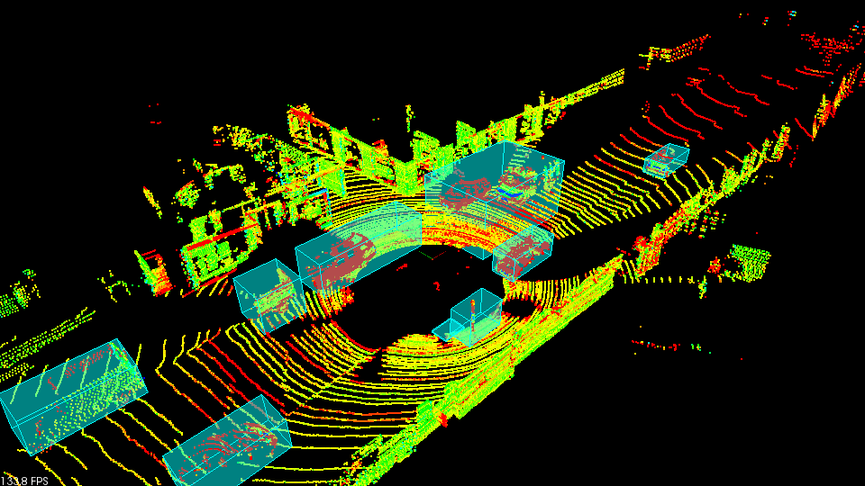

## Project 1: LiDAR Obstacle Detection



### Introduction

This is the first project for the [**Sensor Fusion NanoDegree**](https://www.udacity.com/course/sensor-fusion-engineer-nanodegree--nd313) at Udacity. For this project, you have to detect obstacles/objects in LiDAR point clouds using simple algorithms, such as road segmentation with RANSAC, voxel-based density reduction, and Euclidean clustering based on K-d tree. The animation shows detection results for sample point cloud data available [here](https://github.com/udacity/SFND_Lidar_Obstacle_Detection).

### Installation

#### Ubuntu

```bash
$> sudo apt install libpcl-dev
$> cd ~
$> git clone https://github.com/udacity/SFND_Lidar_Obstacle_Detection.git
$> cd SFND_Lidar_Obstacle_Detection
$> mkdir build && cd build
$> cmake ..
$> make
$> ./environment
```

#### Windows

http://www.pointclouds.org/downloads/windows.html

#### MAC

##### Install via Homebrew
1. install [homebrew](https://brew.sh/)
2. update homebrew
	```bash
	$> brew update
	```
3. add  homebrew science [tap](https://docs.brew.sh/Taps)
	```bash
	$> brew tap brewsci/science
	```
4. view pcl install options
	```bash
	$> brew options pcl
	```
5. install PCL
	```bash
	$> brew install pcl
	```

##### Prebuilt Binaries via Universal Installer
http://www.pointclouds.org/downloads/macosx.html  
NOTE: very old version

##### Build from Source

[PCL Source Github](https://github.com/PointCloudLibrary/pcl)

[PCL Mac Compilation Docs](http://www.pointclouds.org/documentation/tutorials/compiling_pcl_macosx.php)
